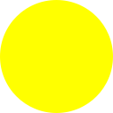

# node-svg-fill


NodeJS package to fill (part of) an SVG image in a given colour.

## Installation

The package can be installed via your favourite `node` package manager:

```
yarn add node-svg-fill
```

## Examples

### Example: Fill a circle completely in yellow

**Input:**


**Code:**

```js
const svgFill = require("node-svg-fill");
console.log(svgFill.fill(input, "#FFFF00"));
```

**Output:**



### Example: Fill letters in two directions with a gradient

**Input:**


**Code:**

```js
const svgFill = require("node-svg-fill");
console.log(svgFill.fillGradient(inputA, [{
    "color": "#FF0000",
    "from": 0,
    "to": 0.20,
}, {
    "color": "#0000FF",
    "from": 0.70,
    "to": 1,
}]));
console.log(svgFill.fillGradient(inputM, [{
    "color": "#FF00FF",
    "from": 0,
    "to": 0.50,
}, {
    "color": "#A0F0F0",
    "from": 0.50,
    "to": 1,
}], 90));
```


